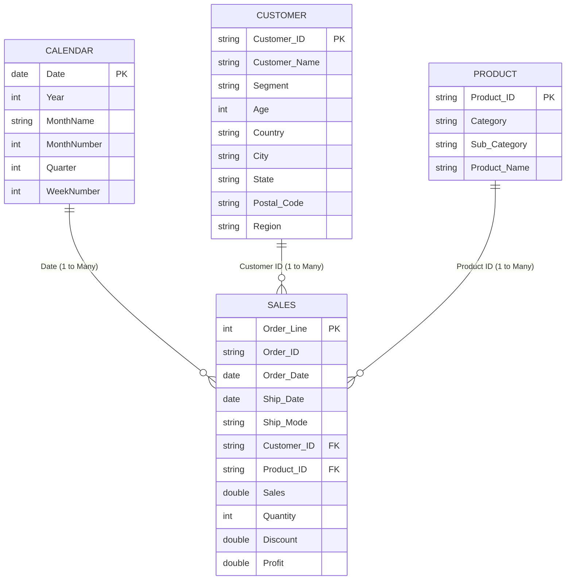

# Job-Ready Data Analytics Portfolio: Power BI, SQL, & Python

Welcome to my professional Data Analytics portfolio repository. This project demonstrates a comprehensive, end-to-end analytics workflow combining **SQL Database Querying**, **Python ETL & Report Automation**, and **Power BI Interactive Business Dashboards** based on the corporate Superstore dataset.

---

## 🌟 Flagship Project: Enterprise Operational Risk Intelligence Dashboard

### 🏦 [American Express GMNS | Operational Risk & Regulatory Issues Intelligence Dashboard](operational_risk_dashboard/)
- **[Power BI .pbix File](operational_risk_dashboard/Enterprise_Operational_Risk_Dashboard.pbix)** | **[Interactive Web Version](operational_risk_dashboard/index.html)** | **[Case Study & DAX Documentation](operational_risk_dashboard/README.md)**
- Built an enterprise operational risk solution analyzing **62,000+ real-world CFPB records** to track SLA compliance (`6.88%` breach rate), issue velocity, and monetary customer remediation.
- Implemented Pareto root-cause analysis, geographic state resolution matrices, and channel vulnerability tracking.

---

## 📂 Portfolio Structure

This portfolio contains:

1. **[Amex GMNS Operational Risk Dashboard](operational_risk_dashboard/)**: End-to-end Risk & Governance solution with active `.pbix`, DAX measures, and web app.
2. **[Superstore Sales Power BI Dashboard](power_bi_dashboard/power_bi_project.pbix)**: Executive sales and margin tracking dashboard with RLS.
2. **[SQL Case Studies](sql_portfolio/queries_50.sql)**: A compilation of 50 structured business queries and 5 distinct case studies (Sales, Subscription Churn, HR Turnover, IPL cricket statistics, and Finance) showcasing Joins, CTEs, Window Functions, and Cohort analyses.
3. **[Python Automation](python_automation/)**: Scripts for automated CSV cleaning using Pandas (`clean_superstore.py`) and scheduled HTML KPI report generation (`generate_report.py`).
4. **[Interview STAR Stories](interview_preparation/STAR_Interview_Stories.md)**: Tailored responses for technical data interviews utilizing the projects built in this repository.

---

## 📊 Data Model & Schema (Star Schema)

The core data model follows a relational **Star Schema** to optimize reporting performance and ensure simple, maintainable DAX queries:



---

## 🚀 Projects Included

### 📈 1. Premium Power BI Dashboard
* **Data Prep**: Implemented custom cleaning steps in **Power Query** (fixed locales, typed fields, handled postal code zeroes).
* **Calculated KPIs**: Created core business metrics in DAX including:
  * **Revenue/Profit/Margin**: `SUM('Sales'[Sales])`, `SUM('Sales'[Profit])`, `DIVIDE([Total Profit], [Total Sales], 0)`
  * **YoY Revenue Growth**: Using `SAMEPERIODLASTYEAR` time intelligence.
  * **Retention & Churn Rate**: Customer cohort measures analyzing repeat buying behaviors.
  * **Average Order Value (AOV)**: Revenue divided by unique orders.
* **Service Features**: Workspace deployment, scheduled refresh via on-premises gateway, and **Row-Level Security (RLS)** by Region.

### 🐍 2. Python Automation & ETL
* **`clean_superstore.py`**: Reads raw sales CSVs, handles missing values, cleans string categories, formats dates, and saves clean files to a production directory.
* **`generate_report.py`**: Connects to the clean data, aggregates key KPIs, and outputs a formatted Markdown/HTML status report that is email-ready.

### 💾 3. SQL Business Analytics
* Over 50 queries tackling real business questions using advanced features like:
  * **Window Functions**: `DENSE_RANK()`, `LEAD()`, `LAG()`, `ROW_NUMBER()` for ranking top sales and calculating MoM change.
  * **CTEs & Joins**: Organizing query steps for complex calculations like customer cohort lifespans.
  * **Case Statements**: Segmenting customers by spending behavior and age buckets.

---

## 🛠️ How to Run & Replicate

### 1. Python Automation Setup
Ensure you have Python installed, then install Pandas:
```bash
pip install pandas
```
Run the ETL cleaner:
```bash
python python_automation/clean_superstore.py
```
Run the KPI report generator:
```bash
python python_automation/generate_report.py
```

### 2. SQL Queries Setup
Import the CSV datasets into your SQL environment (PostgreSQL, MySQL, SQLite, or SQL Server) and run the queries inside the `sql_portfolio/` folder.
