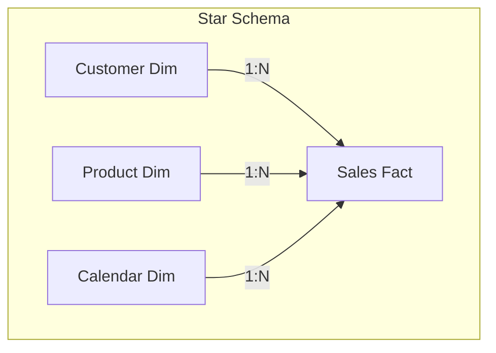

# PL-300 Microsoft Certified Power BI Analyst: Study Guide

This document contains key study notes and architectural guidelines for the PL-300 examination, covering Power Query, Data Modeling, DAX, and security deployment.

---

## 🛠️ Section 1: Power Query & Data Cleaning

Power Query is the ETL (Extract, Transform, Load) engine of Power BI.

### Core Transformations to Know:
1. **Merge vs. Append**:
   * **Merge (Joins)**: Combines two tables horizontally based on matching columns (like SQL Joins). Options include Inner, Left Outer, Right Outer, and Full Outer.
   * **Append (Unions)**: Combines two tables vertically by stacking rows. Requires columns to have matching names and types.
2. **Column Profiling Tools**:
   * **Column Quality**: Shows percentages of Valid, Error, and Empty records.
   * **Column Distribution**: Displays unique and distinct value counts.
   * **Column Profile**: Provides deep stats (min, max, median, distribution).
3. **Data Type Fixes**:
   * Always convert ZIP/Postal Code columns to **Text** to prevent Power BI from dropping leading zeros (e.g. `02138` converting to `2138`).
   * For large transactional tables, set decimals to **Fixed Decimal Number** (Currency) to optimize storage.

---

## 📐 Section 2: Data Modeling (Star vs. Snowflake)

Establishing a clean data model is critical for report performance and writing simple DAX.

### Key Differences:
* **Star Schema (Recommended)**: Fact tables are in the center, directly surrounded by denormalized Dimension tables. Relationships are **1-to-Many (`1:*`)**. This is optimized for fast performance and simple DAX.
* **Snowflake Schema**: Dimension tables are further normalized into sub-tables (e.g., `Product` links to `Sub-Category`, which links to `Category`). This saves database disk space but slows query performance due to multiple joins, complicating DAX filters.

### Modeling Rules of Thumb:
* **Cross-filter direction**: Prefer **Single** (Dimensions filter Facts). Use **Both** (bidirectional) sparingly, as it can cause performance loops and ambiguous relationships.
* **Active vs. Inactive relationships**: A fact table can only have **one active relationship** to a date column. For secondary dates (e.g., `Ship Date` vs. `Order Date`), create inactive relationships and activate them in DAX using `USERELATIONSHIP()`.

---

## 🧮 Section 3: DAX Engine Fundamentals

DAX (Data Analysis Expressions) operates in two execution contexts:

### 1. Row Context
* Occurs when Power BI evaluates a formula row-by-row (used in **Calculated Columns** and iterator functions like `SUMX`, `AVERAGEX`).
* *Example*: `Profit_Column = Sales[Sales] - Sales[Cost]`

### 2. Filter Context
* Occurs when values are filtered by visuals, slicers, or page-level filters (used in **Measures**).
* *Example*: `Total_Sales = SUM(Sales[Sales])`

### Crucial Functions to Master:
* **`CALCULATE`**: The most powerful DAX function. It evaluates an expression in a modified filter context.
* **`DIVIDE`**: Safe division function. Prevents division-by-zero errors by returning a blank or custom fallback.
  * *Usage*: `DIVIDE([Total Profit], [Total Sales], 0)`
* **`ALLEXCEPT`**: Clears all filters in a table except for specified columns. Useful for replicating Tableau's FIXED Level of Detail (LOD) calculations.
* **Time Intelligence**: Functions like `SAMEPERIODLASTYEAR`, `DATEADD`, and `YTD` require a contiguous, marked **Calendar Table** with no missing dates.
